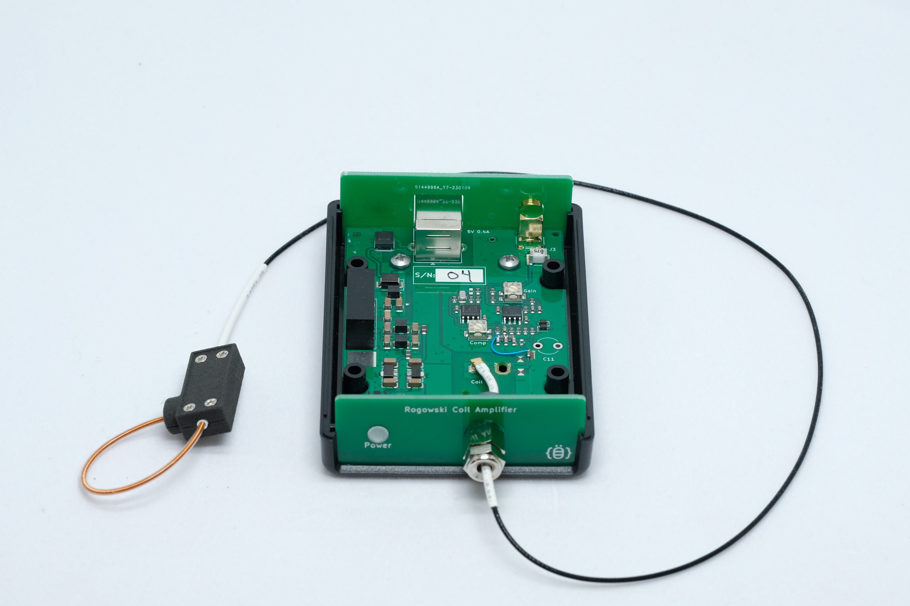
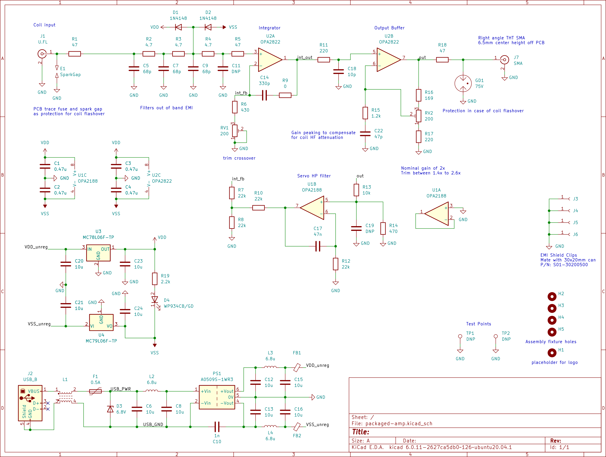
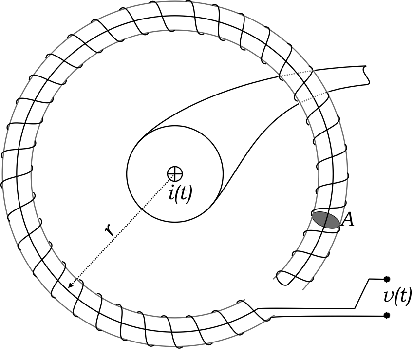
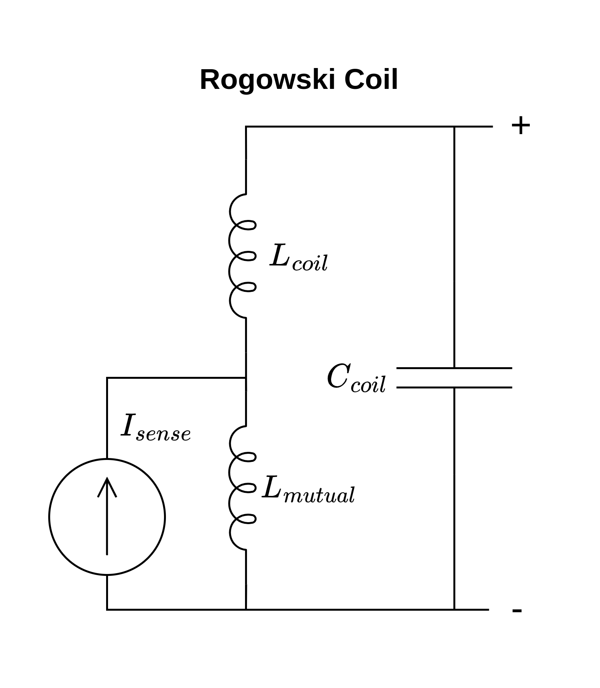
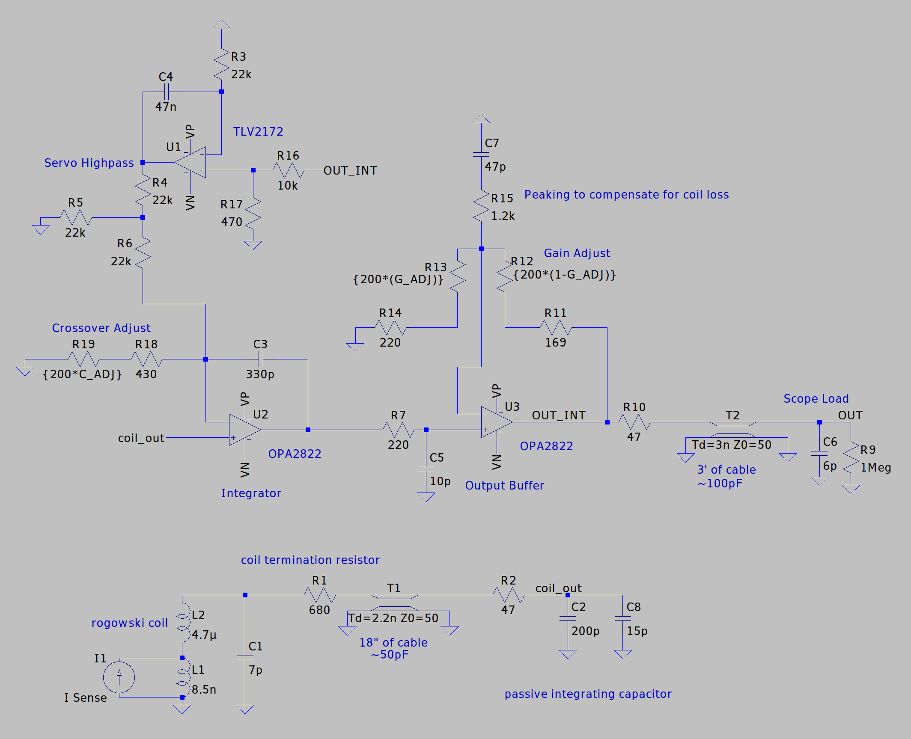
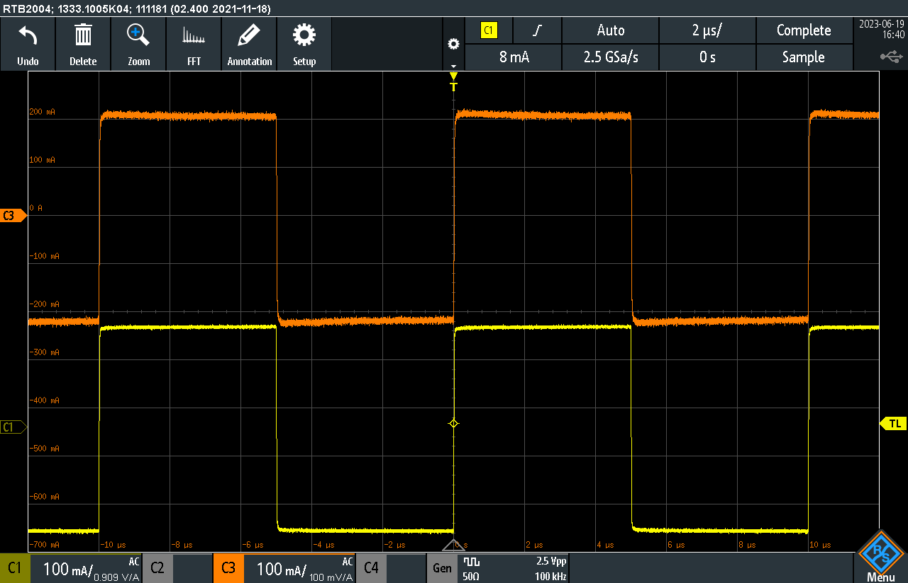
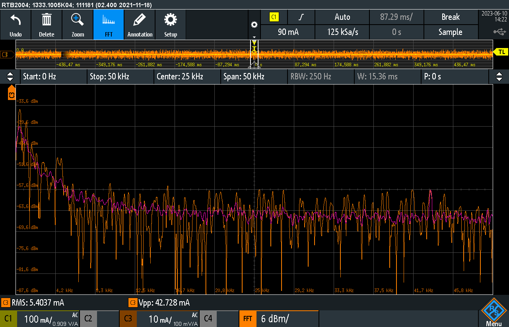
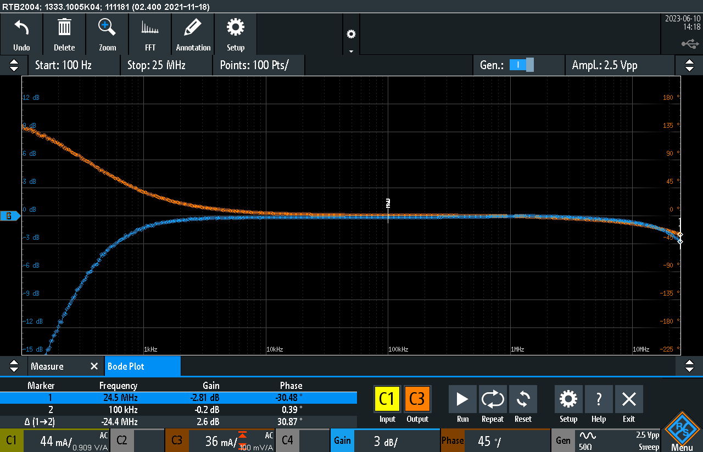
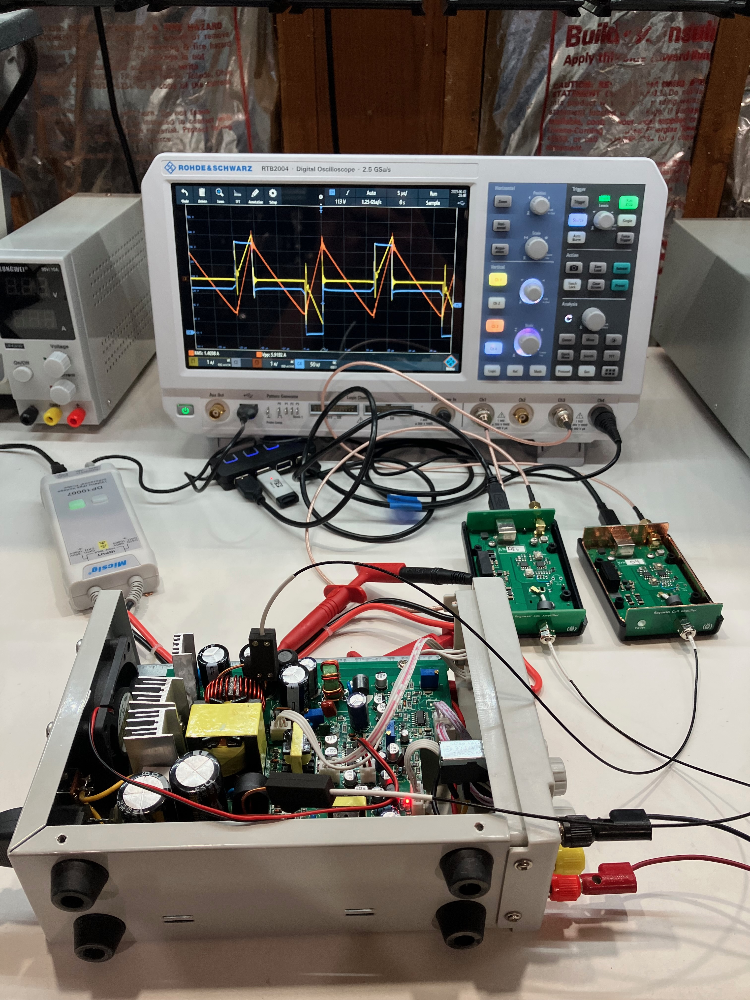

# rogowski-relief
## An open source rogowski coil based current probe

This project is a rogowski coil based current probe designed to measure high frequency AC currents in tight spaces.
The sensing coil is optimized to be small enough to fit between the leads of a TO-220 transistor and can be slipped around the leads of many through hole power components for non-intrusive current measurements. 
The project consists of the rogowski coil and the integrator/amplifier which conditions the signal from the rogowski coil and provides an output voltage proportional to the current flowing in a conductor encircled by the rogowski coil. 

## Operation
The sensing coil is open ended, with the free end held in place by a captive O-ring.
The enables the coil to be placed around a wire without breaking the circuit.
The amplifier provides a 0.1V/A output through a SMA connector and is designed to drive a 1M oscilloscope input through a coaxial cable. 
The amplifier is powered through a USB-B connector and draws less than 2W. 

## Specifications 

### Typical Electrical Performance

- **Bandwidth**: 800 Hz - 25 MHz
- **Sensitivity**: 0.1 Volts/Amp
- **Max Current**: +/- 30 A
- **Noise**: 6 mA RMS
- **Slew Rate**: 1 A/ns 

### Coil
- **OD**: < 1.7mm
- **Length**: 70mm

## Project Status
The current probe meets the original design goals and is suitable for general purpose lab use.
The most recently fabricated version of the integrator had some issues with interference from wireless signals (WiFi and LTE).
The PCB files in the latest commit have layout changes to fit the circuitry under a metal shielding can, which should largely remedy the issue.
There are only minor electrical revisions in the updated version, but it remains untested.

## Project Files

LTSpice simulation files for the time domain and frequency domain as well as noise simulation of the system are in the [sim](sim/) directory.
PCB design files and schematics are in the [PCB](pcb/) directory.
STL files of for the rogowski coil, mechanical BOM, and build instructions are in the [mech](mech/) directory.
Schematic of the integrator provided below for convenience. 

## Operating Principles 

### Rogowski Coil

|  | 
|:--:| 
| *Rogowski Coil Drawing. Source: [Wikipedia](https://en.wikipedia.org/wiki/File:Rogowski_coil.png)* |

A rogowski coil is a toroidally wound air coil, consisting of many turns of wire wrapped around a coil form, with the start and end of the coil form joined together.
Each turn of the coil generates a voltage proportional to the change in the coupled magnetic field.
The sum of the voltage produced by all the turns is proportional to the change in the line integral of magnetic field around the path of the coil. 
As expressed by Ampere's law, the line integral of the magnetic field for any closed path is proportional to the current flowing in the enclosed area. 
Thus, the rogowski coil produces a voltage proportional to the change in current in a wire encircled by the coil with the output signal independent of the positioning of the wire. 
This allows for a flexible air-cored current sensor.
Unlike a current transformer, the rogowski coil generates a voltage proportional to the dI/dt and the signal must be integrated to produce an output proportional to current.
Additionally, as the dI/dt of a DC current is zero, the rogowski coil can not measure a DC current. 

|  | 
|:--:| 
| *Circuit Model of Rogowski Coil* |

The rogowski coil can be modeled as a mutual inductance representing the flux coupling between the encircled wire and the coil, and the physical inductance and capacitance of the coil.
The induced signal can be modeled as a current source equal to that of the current in the encircled wire that is parallel with the mutual inductance.
The inductance and capacitance of the coil limit the maximum bandwidth and are dependent on the geometry of the coil.
The winding diameter and pitch determine the characteristic impedance of the coil, which determines the ratio of inductance to capacitance.
The bandwidth of the rogowski coil is maximized when the coil is terminated with a resistance equal to the characteristic impedance.
The total values of inductance and capacitance are determined by the length of the coil, which is proportional to the number of turns.

### Integrator
This project uses an op-amp based integrator to process the signal from the rogowski coil.
As integrator gain increases at low frequencies, the noise of the integrator ultimately limits the achievable low frequency bandwidth and is one of the most important design criteria.

This design uses an non-inverting integrator, best described in the paper [High Performance Rogowski Current Transducers](https://gmw.com/wp-content/uploads/2019/01/ias_2000_pem.pdf), and a servo high-pass filter with a second op-amp, best described in [A new filter topology for analog high-pass filters](https://www.ti.com/lit/an/slyt299/slyt299.pdf) to roll off the low frequency gain.

|  | 
|:--:| 
| *Annotated schematic of Rogowski coil and integrator* |

The non-inverting integrator consists of a passive RC integrator for high frequency integration and an op-amp integrator for low frequencies.
The passive RC integrator is comprised of the termination resistor for the rogowski coil, which matches the characteristic impedance of the rogowski coil and is co-located with the rogowski coil.
This allows for the capacitance of the cable between the rogowski coil and the integrator, which would otherwise limit bandwidth, to be incorporated as part of the integrator capacitance.
The non-inverting integrator requires that the crossover frequencies of the passive RC integrator and the op-amp match, necessitating a trimmer resistor.

The servo high-pass filter reduces the gain of the integrator below the cutoff frequency instead of leveling off the gain.
This reduces the noise of the system and nulls the DC offset of the amplifier, which could otherwise limit the output signal range.

An additional op-amp is used as an output buffer to provide adjustable gain to normalize the output to a fixed V/A ratio, and provide high frequency peaking to compensate for losses in the rogowski coil.

The op-amp used for the integrator was chosen for its low noise and high bandwidth.
Changing the op-amp can drastically change the output noise.

### Power Supply
The integrator is powered through a USB-B connector.
An isolated DC/DC converter module is uses to provide bipolar outputs of +/-9V which is then regulated down to +/-6V with linear regulators.
The linear regulators reduce switching noise which could otherwise couple into the output.
The isolated DC/DC converters are a commodity component that provide a bipolar output with lower cost and complexity than could be achieved with a solution using discrete components.
Additionally, the isolated module prevents any return current from passing through the output cable, which can inject noise or cause a DC offset.

## Safety 
No safety guarantees or warranty is implied for this design.
However, some safety precautions were taken as the rogowski coil could come into contact with conductors that are at a high voltage.
A PCB trace fuse on both connections from the coil is included on the PCB layout in the hope that the traces will blow and isolate the coil if the coil arcs over.
Additionally, a gas discharge tube is included on the output to further protect a connected device if such an arc-over would occur.

No voltage rating of the rogowski coil is implied or tested
The recommended heat-shrink has a wall thickness of 8 mil and a dielectric strength of 2kV/mil.
The recommended magnetic wire is MW 35-C rated and as such has a minimum dielectric strength of 2340V.
Mechanical wear and high dv/dt signals both adversely impact the voltage rating.

## Demo
|  | 
|:--:| 
| *Probe step response. Reference (yellow) and probe output (orange)* |

|  | 
|:--:| 
| *Output Noise and FFT* |

|  | 
|:--:| 
| *Probe frequency response* |

|   | 
|:--:| 
| *Probing primary current (yellow) and output choke current (orange) of a SMPS* |

## Open Source
This work is licensed under a
[Creative Commons Attribution-ShareAlike 4.0 International License][cc-by-sa].

[![CC BY-SA 4.0][cc-by-sa-image]][cc-by-sa]

[cc-by-sa]: http://creativecommons.org/licenses/by-sa/4.0/
[cc-by-sa-image]: https://licensebuttons.net/l/by-sa/4.0/88x31.png
[cc-by-sa-shield]: https://img.shields.io/badge/License-CC%20BY--SA%204.0-lightgrey.svg